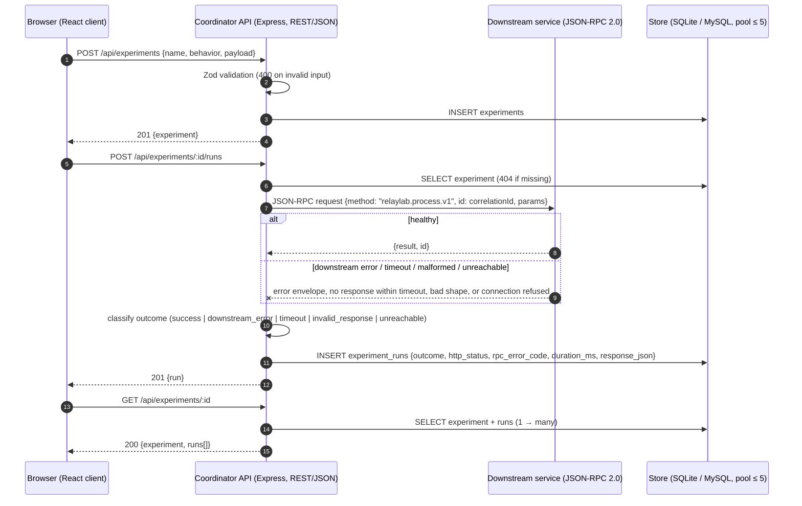

# RelayLab — one request, end to end

Drop-in for the technical report sections 2 and 4 (communication flow). It
renders on GitHub and in Markdown surfaces that support Mermaid; otherwise
export it as an image before using it in the report.

Three processes, two protocols, one durable relationship:
`experiments 1 -> many experiment_runs`.
