# How RelayLab works

RelayLab lets a researcher run an experiment and ask someone else to review the result. The reviewer reads the evidence, leaves feedback, and approves or rejects it. Both people can reopen the same receipt later.

Start with one distinction: **execution outcome and review status answer different questions**. A timeout describes what the coordinator observed. Approval says the reviewer accepts that observation as useful evidence. A timeout can be approved without becoming a successful execution.

## Three objects, three jobs

An experiment is a saved recipe: a name, a behaviour and a JSON payload. A run is one attempt to execute that recipe. A review attaches a researcher's submission and a reviewer's decision to one run.

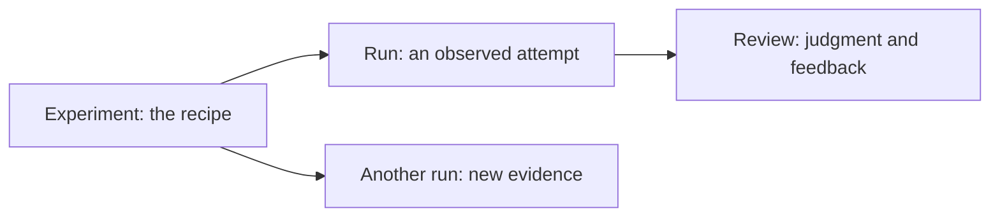

For example, choose Slow, run it, and submit the timeout receipt. A reviewer might write “The deadline behaved as expected; this demonstrates the failure boundary” and approve it. The run still says `timeout`. To try again, create another run. We keep the old evidence.

The relevant browser types live in `client/src/api.ts`: `Experiment`, `ExperimentRun` and `RunReview`. Their HTTP contract is documented in `docs/openapi.json`.

## The whole system

The browser and Android app call the same HTTP API. The group API is an ASP.NET Core coordinator. It calls a separate Node gRPC runner to execute work. Each service owns its own SQLite database.

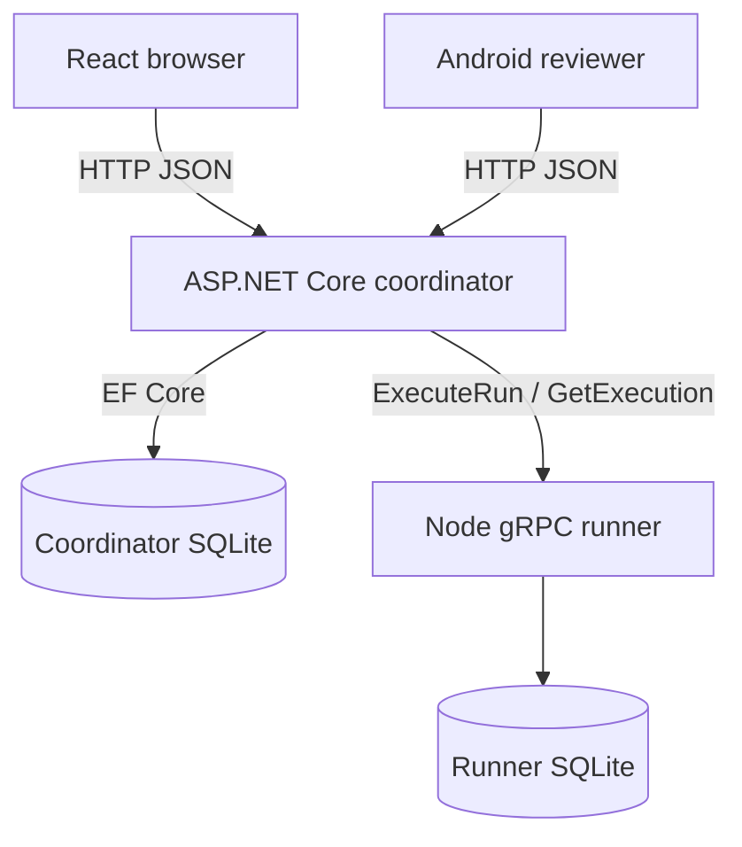

The coordinator owns experiments, attempt receipts and reviews. The runner owns execution identity, state and results. The coordinator never opens the runner's database. It asks for execution status through gRPC.

This separation is the point of the advanced path: a service boundary with independent data ownership. Running two databases alone would not provide that boundary if both services reached into each other's tables.

## Follow one submission

First the researcher saves and runs an experiment. The coordinator validates it, asks the runner to execute it, and stores what it observed. Only then can the researcher submit that run for review.

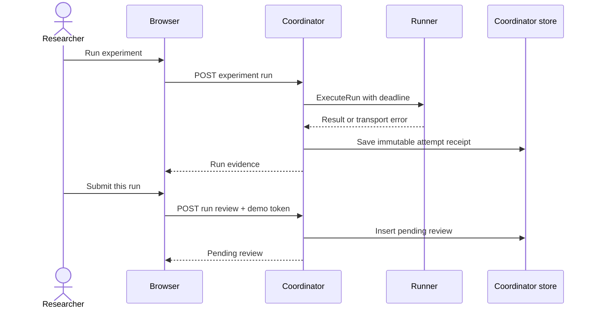

A run can be submitted once. That is enforced by a unique database constraint on `run_reviews.run_id`, not just a disabled browser button. Submitted evidence is protected from deletion, including deletion through its containing experiment.

## Follow one decision

The reviewer refreshes the queue, opens a receipt, inspects the response and writes feedback. The API derives the reviewer identity from the session token. It does not trust an identity sent in a review body.

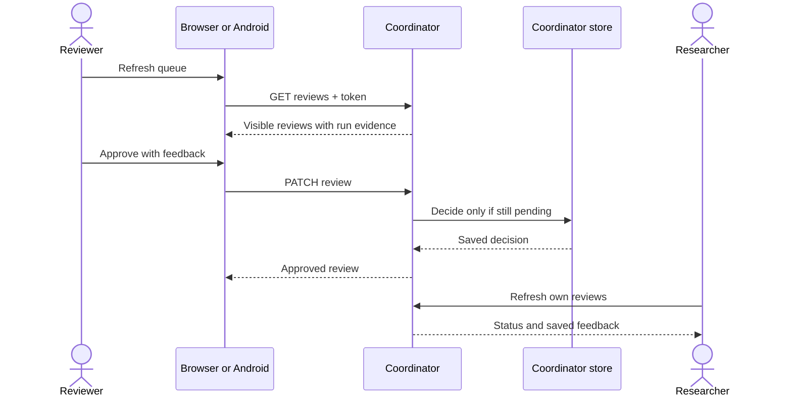

Feedback is required, trimmed, and limited to 2,000 characters. Approval and rejection are final in this prototype. There is no edit-decision workflow.

## Two independent lifecycles

A coordinator attempt ends with one of five outcomes. These are observations at the coordinator boundary, rather than a promise about every future event inside the runner.

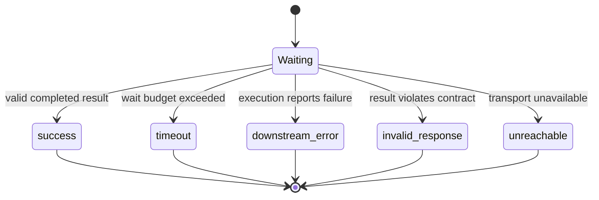

Review status starts only after submission. Neither decision rewrites the run's outcome.

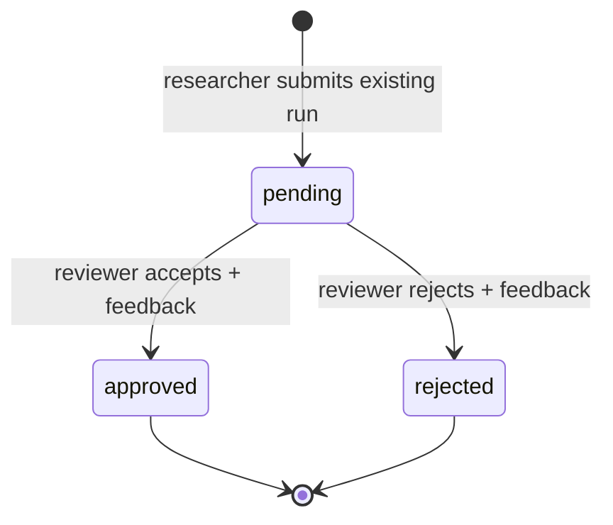

The UI displays these separately so “approved” cannot be mistaken for “executed successfully.”

## Where the code belongs

Controllers translate HTTP requests. Services enforce workflow rules. Repositories read and write records. `RunnerGateway` handles the outbound gRPC boundary. The React and Android clients present the result; neither decides what the database is allowed to do.

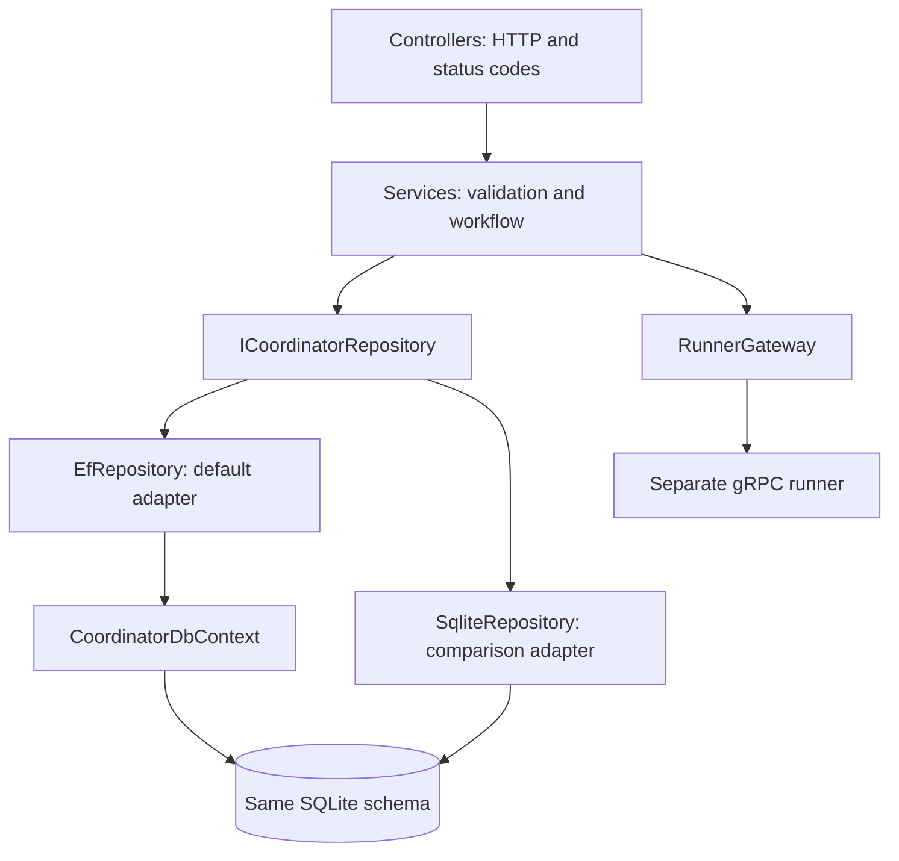

Start reading in `coordinator-dotnet/Controllers/ReviewsController.cs`, then `Services/ReviewService.cs`, then `Data/EfRepository.cs`. For execution, follow `ExperimentService.Execute` into `RunnerGateway` and the runner's `ExecuteRun` implementation.

The interface makes the persistence implementation replaceable without changing the browser contract. EF is the default. The direct SQL adapter remains an independently exercised comparison, selectable with `RELAYLAB_PERSISTENCE_ADAPTER=sql`.

## What gets stored

Within the coordinator database, runs belong to experiments and reviews belong to runs. The runner has a separate ledger. Its references are opaque strings in the coordinator's saved response evidence, not cross-database foreign keys.

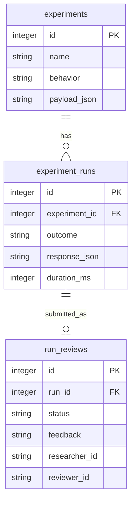

`CoordinatorDbContext` explicitly maps table and column names to the existing schema. Startup adds missing schema through the shared database initializer; it does not reset baseline rows or rely on EF `EnsureCreated` to upgrade an existing database. Each repository operation obtains and disposes its own context through a factory. That avoids sharing one change tracker across simultaneous requests.

## A deadline bounds waiting

The default coordinator budget is 400 ms. The runner persists accepted work before executing it. A deadline can expire while that accepted job is still running.

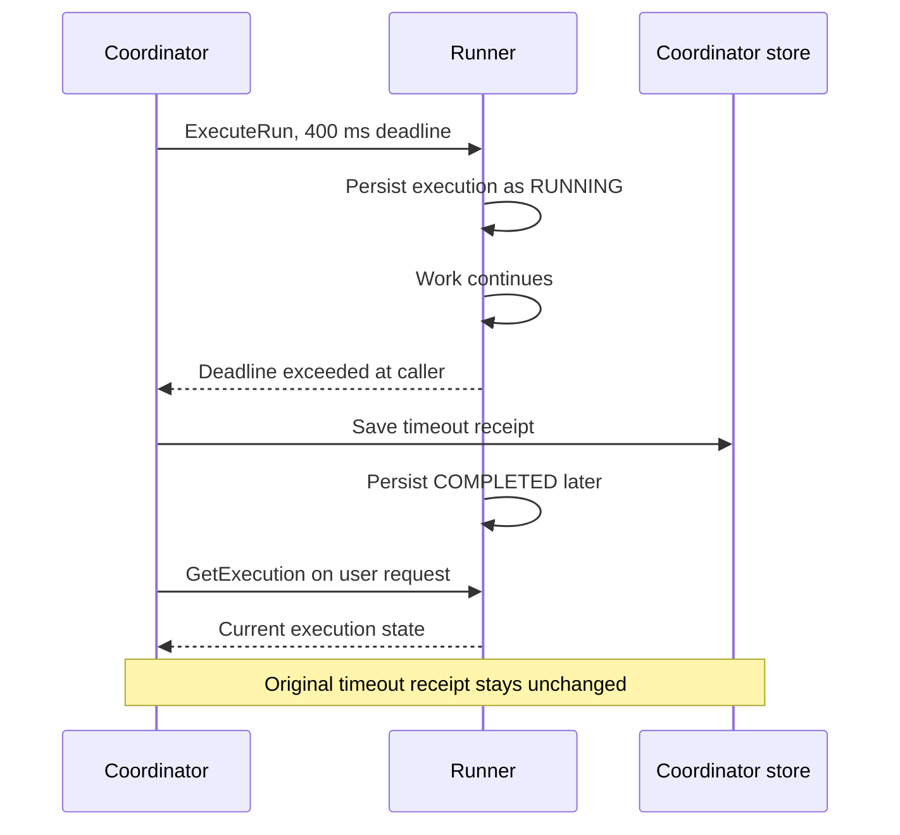

The browser's “Check runner execution” button reads current runner state. That result is supplementary information. It does not repair or overwrite the historical attempt submitted for review.

## Retrying without duplicate work

Each browser run click generates a new request ID and idempotency key. Repeating the same HTTP request with the same key lets the coordinator and runner recognize the operation. Clicking Run again is a new operation.

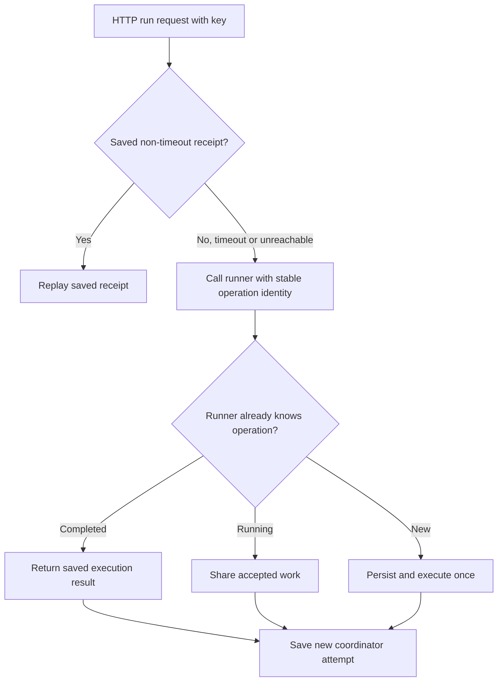

A recovered call can create another coordinator receipt for the same runner operation. That is intentional: attempts and executions are different things. Reusing an operation identity with different content is rejected. This does not establish exactly-once execution for arbitrary external side effects.

After abrupt runner shutdown, previously running rows become `INTERRUPTED` during recovery. They are uncertain work, so startup does not silently execute them again. See `docs/GRPC_RUNNER.md` for the lease and recovery rules.

## Two reviewers, one decision

Disabling the Approve button helps one client. It cannot protect against another tab deciding the same review a moment earlier. The database condition provides the guarantee.

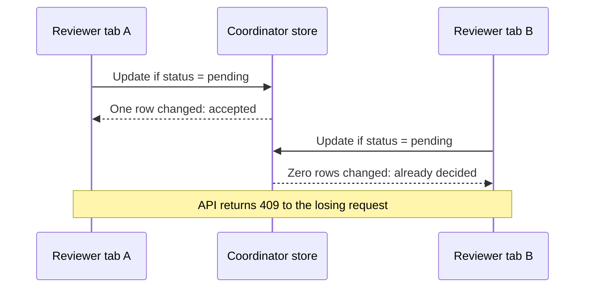

The update and read-back happen within a transaction. On a conflict, clients fetch the winning decision. On a network failure they keep draft feedback, show the last retrieved evidence, and disable decisions until a successful refresh confirms current status.

## Android notifications are polled

Android uses the same review endpoints as the browser. While the reviewer screen is active it refreshes roughly every 10 seconds. WorkManager also schedules background checks at an interval of at least 15 minutes. Android may delay those checks.

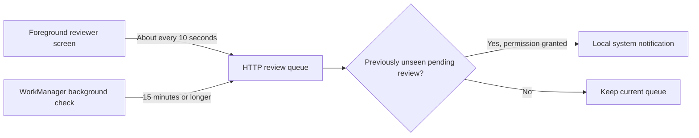

This is not immediate remote push. Notifications depend on the app's demo session, network reachability, permission and Android scheduling. Natural background delivery and physical-device behaviour need their own evidence; an emulator build alone does not prove either.

## Demo identities and shared experiments

Anyone can select Researcher A, Researcher B or Reviewer. The token selects a role for this local demonstration, expires after one hour, and is lost on coordinator restart. Saved reviews survive that restart.

Researcher review lists are scoped to their submissions. Experiments and unclaimed runs remain shared and unauthenticated. A researcher can submit any unclaimed run in that shared lab. Real account ownership is future team work, not an implemented security claim.

## What verification proves

We test different boundaries because a successful build cannot tell us whether feedback survives a restart.

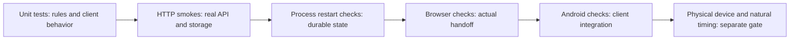

`npm run verify:group` runs workspace tests, type checks, builds, real HTTP and gRPC smoke checks, both .NET persistence adapters and dependency audits. CI also exercises the original Node MySQL adapter and the Android build. The .NET coordinator itself uses SQLite; it does not currently offer a MySQL adapter.

For a first run, read `docs/GETTING_STARTED.md`. For precise boundaries, read `docs/DOTNET_COORDINATOR.md`, `docs/GROUP_WORKFLOW.md` and `docs/ANDROID_REVIEWER.md`. Team responsibilities and the next small contributions are in `docs/TEAM_HANDOFF.md`.
