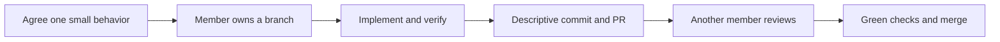

# Team handoff

Main is the shared starting point. The existing implementation gives us something to run and critique. It is not evidence that all three members contributed, agreed to these responsibilities, or completed their individual investigation.

## Proposed split to agree together

These are proposed lanes, not accepted assignments. Each lane contains technical decisions and implementation work, rather than asking someone to rubber-stamp a finished project.

| Proposed lane | Responsibility | First small contribution | Acceptance evidence |
| --- | --- | --- | --- |
| Backend member | .NET coordinator and EF persistence | Review the EF boundary, then improve one documented storage/error case or implement an agreed backend requirement | A focused public-HTTP check, a descriptive commit, and a PR explaining the changed behavior |
| Workflow and integration member | Review workflow contract and integration tests | Agree review visibility/ownership rules, then add and implement one missing API scenario | The scenario failing before the change and passing through real HTTP afterward |
| Browser and integration member | Browser workspace, explanation and integration | Finish this UI/docs checkpoint, then integrate teammate PRs and keep the demo runnable | Browser handoff evidence, reviewed PRs and CI on the merged source |

Android ownership still needs explicit agreement. The existing native baseline can be taken over by whichever member wants the mobile lane. An Android owner should make a real feature or reliability improvement and collect their own emulator/device evidence. The browser owner should not automatically absorb that lane as well.

## Decisions that still belong to the team

- Should experiments belong to individual researchers? Today experiments are shared; review submissions are scoped by actor. Agree the behavior before changing the API or database.
- Is polled Android notification delivery enough for the requirement? Today foreground refresh is about 10 seconds and background checks are at least 15 minutes. Instant push would be new scope.
- What workload and response-time checks will the demo claim? Agree the dataset and concurrent-client case, then measure it.
- Is the optional WebSocket bonus worth the remaining time? Keep it behind the core workflow's acceptance checks.

Real authentication, cross-host transport and production deployment are separate scope choices. Do not quietly turn the local demonstration into a production claim.

## A contribution should be easy to review

Start from current main and create a topic branch. Pick one concrete user-visible or service behavior. Open a PR with the trigger, the changed result and the verification performed. Keep unrelated refactors out of that PR. Another member reviews the code and can run the acceptance path.

Commit at meaningful working boundaries, such as “Reject decisions when refreshed evidence is stale.” Small descriptive commits help explain cause and effect. Splitting one finished change into arbitrary files, backdating, or adding empty commits does not create a genuine development history.

The 28 October deadline does not make a late start cover three weeks of group work. Preserve existing dates accurately and clarify any uncertainty in the assessment requirements with the appropriate human process. Individual reports and personal reflections remain each member's work.

## Handoff boundaries

- Browser behavior: `client/src/App.tsx`, `ReviewWorkspace.tsx`, `RunnerExecutionStatus.tsx` and their tests.
- Coordinator workflow: `coordinator-dotnet/Services/` and `Controllers/`.
- Persistence: `coordinator-dotnet/Data/`, with EF default and direct SQL comparison adapter.
- Runner: `runner/src/`, with shared `protocol/runner.proto`.
- Android: `android/` and `docs/ANDROID_REVIEWER.md`.
- Shared HTTP contract: `docs/openapi.json`.
- Whole-system verification: `npm run verify:group` and `.github/workflows/verify.yml`.

Read `docs/GETTING_STARTED.md` to run one complete handoff. Read `docs/HOW_IT_WORKS.md` to understand the boundaries before editing them. Record meaningful verified milestones in `docs/DEVELOPMENT_LOG.md`, with real dates and attribution to the person who did the work.
